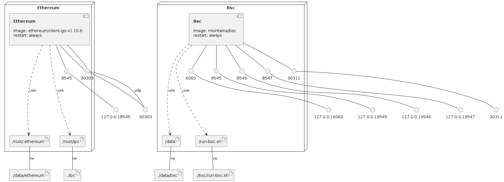

This repository contains Docker Compose file to run various EVM based blockchains.

The compose provides high speed inter-process communication sockets (IPC), on beside the normal HTTP JSON-RPC, for communicating with the nodes. 

# Ethereum mainnet 

* Based on the official [GoEthereum Docker image](https://hub.docker.com/r/ethereum/client-go)

* Network id: 1

* IPC socket: `./ipc/ethereum.ipc`

* HTTP RPC Port: 8545

* Data volume: `./data/ethereum`

## Commands

Help: `docker-compose run ethereum --help`

Shell: (not available)

Build and run as daemon: `docker-compose up --build -d ethereum`

Restart: `docker-compose restart ethereum`

Logs: `docker-compose logs ethereum`

(todo) Show sync status: `docker-compose run ethereum attach http://127.0.0.1:8545 --exec "eth.syncing"` 

# Binance Smart Chain (BSC)

* Based on [this recipe](https://github.com/ServerContainers/bsc)

* Network id: 56

* HTTP RPC ports 9545, 9546 (Websockets)

* Data is stored in a host folder `./data/bsc`

* [Documentation](https://docs.binance.org/smart-chain/developer/fullnode.html)

* [Releases](https://github.com/binance-chain/bsc/releases)

Notes

* [Geth garbage collection disabled](https://github.com/ethereum/go-ethereum/issues/21865)

* [Snap sync enabled](https://github.com/binance-chain/bsc/releases/tag/v1.1.0-beta) as 1.1.0-beta release

## Commands

BSC geth might take a minute or two before it starts to respond to port 9545.
BSC logs seem to be very terse and you cannot get useful log output even with `-verbosity 5` - you cannot see from the logs if it is syncing or not. 

Help: `docker-compose run bsc /usr/bin/geth --help`

Shell: `docker-compose run bsc bash`

Build and run as daemon: `docker-compose up --build -d bsc`

Restart: `docker-compose restart bsc`

Logs: `docker-compose logs bsc`

Geth console: `docker-compose run bsc /usr/bin/geth attach http://127.0.0.1:9545`

Show sync status: `docker-compose exec bsc /usr/bin/geth attach http://127.0.0.1:9545 --exec "eth.syncing"` 

# Polygon

Please see [Polygon DAppNode compose here](https://github.com/MysticRyuujin/dappnode-polygon).

# NVMe drivers and RAID0 on Hetzner

Here is how to tpo configure your drives to RAID0 (max speed, no redundancy) on Hetzner.

Boot a Hetzner server to a rescue mode.

SSH in.

Start installation

```shell
installimage
```

Choose Ubuntu 20.04.

The editor will pop up and allow you to configure partitions.

Set software raid settings

```shell
# RAID enabled
SWRAID 1

# Use  stripe mode
SWRAIDLEVEL 0
```

Set the partition scheme as follow:

```
PART swap swap 32G
PART /boot ext3 512M
PART / xfs all
```

ext4 does not support large multi terabyte file systems, so we go with XFS. XFS might be even better for GoEthereum node like write loads.

## Different disk sizes

If you have different sizes disk, then disable installation raid by setting `SWRAID 0`.
This is because RAID 0 goes by the smallest disk and you want to utilise all the capacity. 

Use `mdadm` tool from the command line to create a RAID particion and mount it in a special mount point.

- Create stripe partition with `mdadm`
- `mkfs -f -t xfs /dev/md2`
- `mkdir /bsc`
- `blkid` to find out the UUID of `/dev/md2`
- `nano /etc/fstab` and add the partition there
- `mount -a` to verify `/etc/fstab` is good

## BSC further info

[Latest releases on Github](https://github.com/binance-chain/bsc/releases)

BSC command:

```shell
./geth_linux \
  --config ./config.toml \
  --datadir ./data/bsc \
  --cache 32000 \
  --txlookuplimit 0 \
  --http.port 9545 \
  --http.addr 127.0.0.1 \
  --http.vhosts=* \
  --http.api=eth,net,web3,debug \
  --graphql \
  --graphql.vhosts=* \
  --snapshot=false \
  --diffsync \
  --verbosity 3
```

Cache should be half of the RAM.

[diffsync was added in BSC geth 1.1.5](https://github.com/binance-chain/bsc/releases/tag/v1.1.5)

[txlookuplimit 0 is needed to be able to fetch historical transactions](https://ethereum.stackexchange.com/questions/85261/is-ethereum-fast-sync-feasible-to-get-logs/85306#85306). 
[txlookuplimit 0 also here in geth release notes](https://newreleases.io/project/github/ethereum/go-ethereum/release/v1.10.0).

You can speed up a bit by adding the [following config.toml bit](https://github.com/binance-chain/bsc/issues/502#issuecomment-974785413):

```toml
[Eth]
DisablePeerTxBroadcast = true
```

Make sure [StaticNodes in the config.toml contains the latest list](https://github.com/binance-chain/bsc/issues/544#issuecomment-974792305)

## BSC pruning instructions

[See here](https://github.com/binance-chain/bsc/issues/502).
[See also pruning instructions for Polygon](https://forum.matic.network/t/bor-offline-pruning/1830).

To prune:

```shell
geth snapshot prune-state --datadir ./data/bsc
```

## Monitoring node

Use `atop` (`apt install atop`).

You can see disk business in the stats. This is often the bottleneck for the node syncing.  

```
DSK |      nvme2n1  | busy     89%  |               | read   13669  | write   4630  |               | KiB/r     13  | KiB/w     62 |  MBr/s   18.3 |               |  MBw/s   28.3 |  avq     0.44 |               |  avio 0.49 ms |
DSK |      nvme3n1  | busy     89%  |               | read   13532  | write   4166  |               | KiB/r     13  | KiB/w     66 |  MBr/s   17.7 |               |  MBw/s   27.0 |  avq     1.10 |               |  avio 0.50 ms |
```

### Infrastructure model

